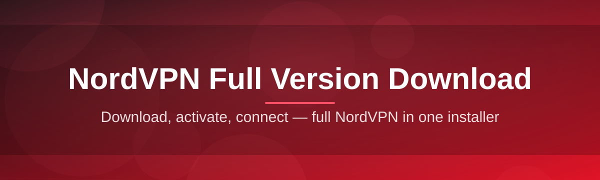
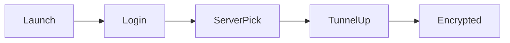

# nordvpn-full-suite 🛡️⚡

  

*One standalone package that turns "I should really get a VPN" into "wait, that was it?"*

  

---

## 🌍 Overview

Let's be honest — the VPN space in 2026 is a swamp of fifty near-identical apps, all promising "military-grade encryption" while quietly throttling your speed on a Tuesday afternoon. **nordvpn-full-suite** exists because we got tired of digging through bloated installers, browser extensions with 40 permissions, and setup wizards that take longer than the actual download. This repository packages the full NordVPN experience into a single, no-nonsense suite — built for people who just want their traffic encrypted and their evenings free.

This project is aimed squarely at power users, remote workers juggling regional content restrictions, and privacy-conscious folks who are done pretending public Wi-Fi at the airport is "probably fine." Whether you're chasing a stable connection for streaming, trying to keep your ISP out of your business, or just want a NordVPN full version download that doesn't require a PhD in networking to configure — this is the landing spot.

We're not reinventing VPN tunneling protocols here. What we *are* doing is stripping away the friction: no forced account walls before you even see the app, no dark-pattern upsells buried in settings, no mystery background processes eating your RAM. Just a clean, maintained suite that respects your time and your bandwidth.

## 🚀 Get the Suite

> [!TIP]
> Bookmark the landing page above. We ship updates faster than most people update their passwords.

---

## 🧨 What Makes This Thing Actually Good

- **Instant tunnel handshake** — connection negotiation that doesn't make you stare at a spinning wheel wondering if it's frozen or just thinking really hard.

- **Adaptive server hopping** — automatically slides you to the next-best node when your current one gets congested, instead of leaving you stuck on a dying connection like it's 2015 dial-up.

- **Kill-switch that actually switches** — if the tunnel drops, your internet drops with it. No leaking your real IP for three seconds while the app "reconnects."

- **Split-tunneling profiles** — route your torrent client through the tunnel and your work Slack outside it, or vice versa. Your call, your rules.

- **Zero telemetry bloat** — the suite talks to servers it needs to talk to. That's it. No mystery analytics pinging home every 30 seconds.

- **Dark/light adaptive UI** — because squinting at a blinding white settings panel at 2 AM is a crime against humanity.

- **One-click region switching** — a searchable map-style picker instead of a dropdown with 60 unlabeled country codes.

- **Offline-friendly installer** — the standalone package doesn't demand a constant internet connection just to *install* a tool whose entire job is managing your internet connection. The irony was not lost on us.

> [!NOTE]
> This suite focuses on the **full desktop experience** — deep protocol control, granular settings, and a UI that doesn't feel like a mobile app awkwardly stretched onto a monitor.

---

## 🏁 How to Get Started

1. Hit the **GET NordVPN Full Version 2026** button above — it takes you straight to the official project landing page.

2. Download the standalone package. No bundled toolbars, no "recommended software" checkboxes to uncheck.

3. Run the installer and follow the on-screen prompts — takes about as long as making toast.

4. Launch the app, pick a server or let auto-select do the thinking, and you're tunneled.

> [!IMPORTANT]
> Always download from the official landing page linked in this README. Third-party mirrors are how people end up with something that *isn't* actually this project.

---

## 🖥️ System Requirements

| Component | Minimum | Recommended |
|---|---|---|
| **OS** | Windows 10 (64-bit) | Windows 11 (64-bit) |
| **RAM** | 4 GB | 8 GB or more |
| **Disk Space** | 500 MB free | 1 GB free |

📋 Full compatibility notes

- Standalone installer — no external runtime dependencies required.

- Works on both Home and Pro editions of Windows 10/11.

- Admin rights needed during install for the network driver component (this is normal for any VPN client, not a red flag).

- Not currently packaged for macOS or Linux — that's a roadmap item, not an oversight.

---

## ⚙️ How It Works

The architecture is intentionally boring — boring means stable. Here's the flow from launch to encrypted traffic:

1. **Launch** — the app boots and checks your current network profile.

2. **Authenticate** — you sign in, credentials get handled locally and passed to the tunnel handler.

3. **Server select** — automatic or manual pick, based on latency and load.

4. **Tunnel established** — encrypted connection spins up, kill-switch arms itself.

5. **Traffic flows** — your data leaves through the tunnel, your ISP sees nothing but noise.

---

## 🩺 Troubleshooting

**Q: The app says "connecting" forever and never finishes — what gives?**
A: Usually a firewall or antivirus is quietly strangling the connection. Temporarily whitelist the app and try again — nine times out of ten that's it.

**Q: My download speed tanked after connecting.**
A: Switch servers. Some nodes get crowded during peak hours in their region — the auto-select feature exists precisely to dodge this, so use it.

**Q: Windows Defender flagged the installer.**
A: Common with any VPN-tunneling software since it installs a network driver. Verify you downloaded from the official landing page linked in this README, then allow it.

**Q: The kill-switch won't turn off.**
A: That's by design — it only disengages once a stable connection or manual override confirms you're safe. Check Settings > Network > Kill Switch to adjust sensitivity.

**Q: Can I run this alongside another VPN client?**
A: Technically possible, practically a headache. Two tunnel drivers fighting for the same network adapter rarely ends well. Pick one.

**Q: App won't launch after a Windows update.**
A: Reboot first (yes, actually do it), then reinstall the network driver component from Settings > Advanced if the issue persists.

---

## 🎨 UI / UX Details

 

| Shortcut | Action |
|---|---|
| `Ctrl + Q` | Quick connect to fastest server |
| `Ctrl + D` | Disconnect tunnel |
| `Ctrl + K` | Toggle kill-switch |
| `Ctrl + ,` | Open settings panel |
| `Ctrl + Shift + M` | Switch map/list server view |

- Themes: **Dark**, **Light**, and **Auto** (follows your OS setting like a well-trained pet).

- Settings are organized into four tabs: General, Network, Privacy, Advanced — nothing hidden three menus deep.

- Notification style is configurable — silent, minimal toast, or full banner, depending on how much you enjoy popups.

---

## 🤝 Contributing & Community

> [!TIP]
> New contributors are genuinely welcome — check open issues tagged `good-first-issue` before diving into something huge.

We accept pull requests, bug reports, and honest feedback (even the blunt kind). Before submitting:

- Search existing issues so we're not triaging five copies of the same bug report.

- Keep PRs focused — one fix or feature per PR, not a grab-bag of unrelated changes.

- Be respectful in discussions. Strong opinions about VPN protocols are welcome; hostility is not.

> [!WARNING]
> Issues demanding features that compromise user privacy (extra tracking, ad injection, etc.) will be closed without ceremony. That's not the project this is.

---

## 📜 License

Released under the [MIT License](LICENSE), 2026. Use it, fork it, learn from it — just don't slap your name on it and pretend you wrote it from scratch.

## ⚠️ Disclaimer

This project is an independent, community-maintained suite built around NordVPN full version download workflows. It is not officially affiliated with, endorsed by, or sponsored by Nord Security. All trademarks belong to their respective owners. Use responsibly and in accordance with the terms of service of any VPN provider you connect through.

---

